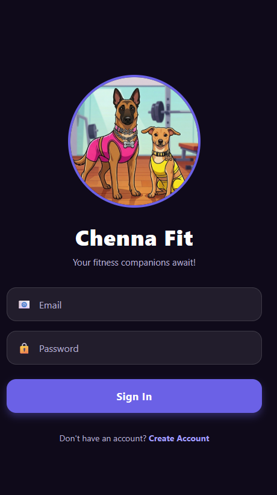
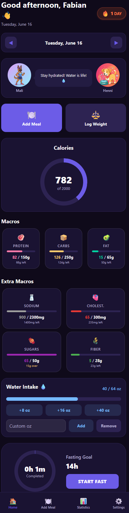
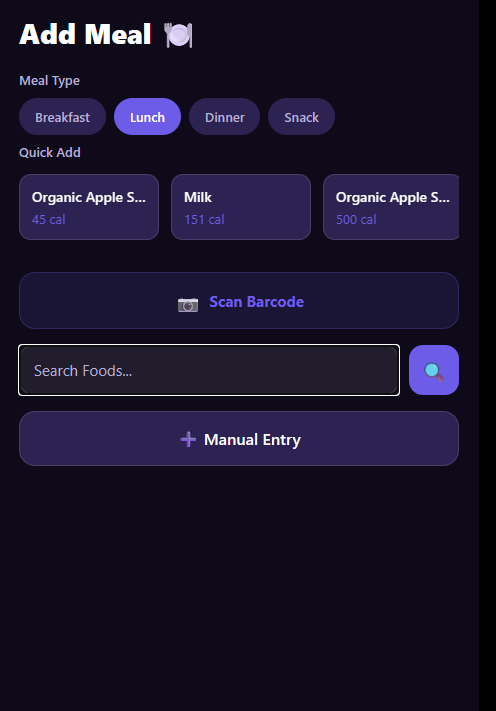
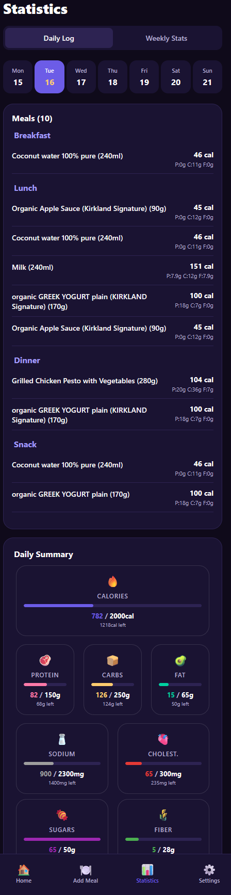
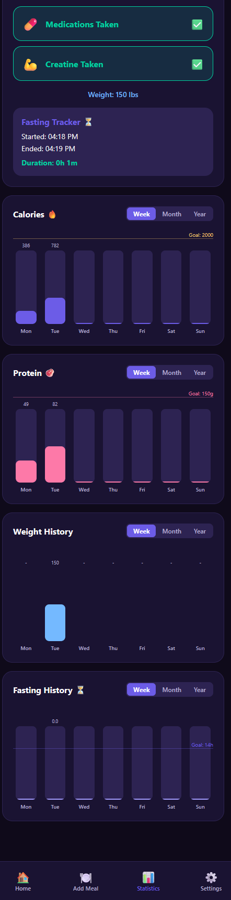
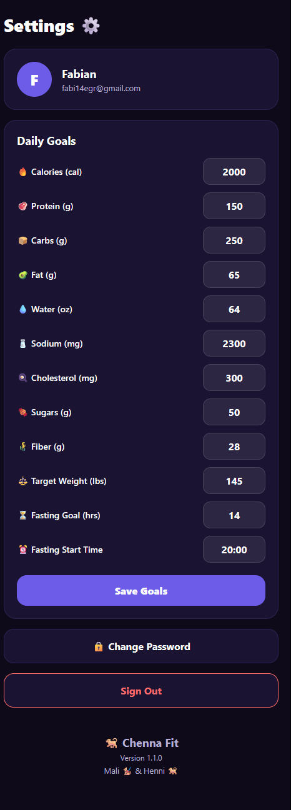

# Chenna Fit — Interactive Health & Nutrition Tracker

Chenna Fit is a beautiful, interactive mobile health and nutrition tracker built with **React Native (Expo)**, **TypeScript**, **Zustand**, and **Firebase** (designed for human health tracking with a fun companion mascot). 

Users can log their meals, water intake, daily macro-nutrients, and weight. The unique feature is **Henni the Mascot**—an adorable virtual dog that stays active on your dashboard, sleeping, eating, drinking, or encouraging you based on your habits, streak, and log history!

---

## App Screenshots

| Login Page | Home Page | Add Meal Page |
| --- | --- | --- |
|  |  |  |

| Statistics & Fasting | Fasting & Meal History | Settings |
| --- | --- | --- |
|  |  |  |

---

## What's New

- **Daily Logging Streak:** Added an animated fire streak badge to the home screen header to encourage logging consistency. Automatically persists and calculates consecutive tracking days.
- **Visual Fasting Tracker:** Integrated an interactive circular progress timer on the dashboard allowing users to start, stop, and track active fasts in real time.
- **Fasting History Logs:** View details and trends of past fasting sessions alongside nutrition logs in the redesigned History tab.
- **Water Quick-Presets:** Log common water amounts quickly with preset buttons (`+8 oz`, `+16 oz`, and `+40 oz`).
- **Full Web Barcode Scanning:** Support for live camera barcode scanning directly in web browsers via `@zxing/library`.

---

## Features

- **Interactive Mascot (Henni):** A virtual dog that reacts dynamically to your logging actions (eating, drinking, celebrating, sleeping, and encouraging).
- **Daily logging Streak Counter:** An animated, vibrant fire streak badge showing consecutive days of logging activity (meals or water).
- **Interactive Fasting Tracker:** A visual circular timer showing fasting progress with real-time feedback and session logging.
- **Complete Meal & Macro Logger:** Track calories, proteins, carbs, fats, sodium, cholesterol, sugars, and fiber. Categorize by Breakfast, Lunch, Dinner, and Snacks.
- **Barcode Scanner & Caching:** Scan product barcodes instantly on both native mobile (using `expo-camera`) and web browsers (using `@zxing/library` camera stream decoding). Integrates with the **Open Food Facts API**, custom database caching, and fallback manual entry.
- **Water Intake Tracker & Presets:** Set daily hydration targets, log water intake with a flexible numeric input, or use the dynamic `+8 oz`, `+16 oz`, and `+40 oz` quick-preset buttons.
- **Statistics & Progress Charts:** Toggle weekly, monthly, and yearly bar charts for Calories, Protein, and Weight logs.
- **Interactive Meal & Fasting Manager:** Tap any logged meal to edit its quantity (which dynamically recalculates nutritional macros) or delete it directly from the Statistics page. View and monitor past fasting history logs.
- **Offline-First & Sync:** Clean state management using **Zustand** combined with local caching and online sync via **Firebase Authentication & Firestore**.

---

## Tech Stack

- **Framework:** [Expo](https://expo.dev/) (React Native for Native & Web)
- **Language:** TypeScript
- **State Management:** [Zustand](https://github.com/pmndrs/zustand)
- **Database, Auth & Hosting:** [Firebase Auth](https://firebase.google.com/docs/auth), [Cloud Firestore](https://firebase.google.com/docs/firestore) & [Firebase Hosting](https://firebase.google.com/docs/hosting)
- **API Integrations:** [Open Food Facts API](https://world.openfoodfacts.org/data) (Barcode lookup)
- **Navigation:** [React Navigation](https://reactnavigation.org/) (Native Stack & Bottom Tabs)
- **Styling & UI:** Expo Linear Gradient, React Native Vector Icons, and a cohesive, vibrant modern dark/light system theme.

---

## Project Structure

```text
Chenna_Fit/
├── assets/             # Images, icons, fonts, and Henni mascot assets
├── public/             # Web public assets (favicon, apple-touch-icon)
├── src/
│   ├── components/     # Reusable UI widgets (Macro cards, input fields, custom buttons)
│   ├── config/         # Firebase initialization and configuration
│   ├── screens/        # Primary views (Dashboard, AddMeal, History (Statistics Tab), Settings, Scan)
│   ├── services/       # Firebase, Open Food Facts API, and local Cache integrations
│   ├── store/          # Zustand store for daily state, metrics, and mascot rules
│   ├── theme/          # Custom color palette, styling tokens, and layout guidelines
│   ├── types/          # Strict TypeScript interfaces (User, Meal, Macros, MascotState)
│   └── utils/          # Formatting helpers, date builders, and calculations
├── App.tsx             # Main entry point & root navigator configuration
├── app.json            # Expo configuration profile
├── firebase.json       # Firebase CLI hosting and rules configuration
├── firestore.rules     # Cloud Firestore security rules
├── package.json        # Dependencies & package scripts
└── README.md           # Project documentation
```

---

## Getting Started

Follow these steps to run the application locally on your machine:

### Prerequisite
Make sure you have **Node.js** (v18+) and **git** installed. We recommend installing the Expo Go app on your iOS/Android device to preview the project live.

### 1. Clone the repository
```bash
git clone <your-repository-url>
cd Chenna_Fit
```

### 2. Install dependencies
```bash
npm install
```

### 3. Setup Firebase
The project is configured with a default Firebase App. If you want to use your own Firebase database:
1. Create a Firebase project at [Firebase Console](https://console.firebase.google.com/).
2. Enable **Authentication** (Email/Password) and **Firestore Database**.
3. Deploy the Firestore security rules defined in [firestore.rules](file:///c:/Inventos_AI/Perrito_Fit/firestore.rules).
4. Update [src/config/firebase.ts](file:///c:/Inventos_AI/Perrito_Fit/src/config/firebase.ts) with your credentials:
   ```typescript
   const firebaseConfig = {
     apiKey: "YOUR_API_KEY",
     authDomain: "YOUR_AUTH_DOMAIN",
     projectId: "YOUR_PROJECT_ID",
     storageBucket: "YOUR_STORAGE_BUCKET",
     messagingSenderId: "YOUR_MESSAGING_SENDER_ID",
     appId: "YOUR_APP_ID"
   };
   ```

### 4. Run the Dev Server
Start the Metro bundler:
```bash
# For mobile platforms (iOS/Android)
npm run start

# For web platform
npm run web
```
For mobile, use the QR code in your terminal to open it in **Expo Go** (iOS/Android), or press `a` for Android Emulator / `i` for iOS Simulator.

### 5. Build and Deploy Web App (Firebase Hosting)
To export the web app bundle and deploy it to Firebase Hosting:
1. Ensure the [Firebase CLI](https://firebase.google.com/docs/cli) is installed and you've logged in (`firebase login`).
2. Build and deploy with:
   ```bash
   npm run deploy:web
   ```

---

## License

Distributed under the MIT License. See [LICENSE](file:///c:/Inventos_AI/Perrito_Fit/LICENSE) for more details.

---

*Made with love by the Chenna Fit team.*
